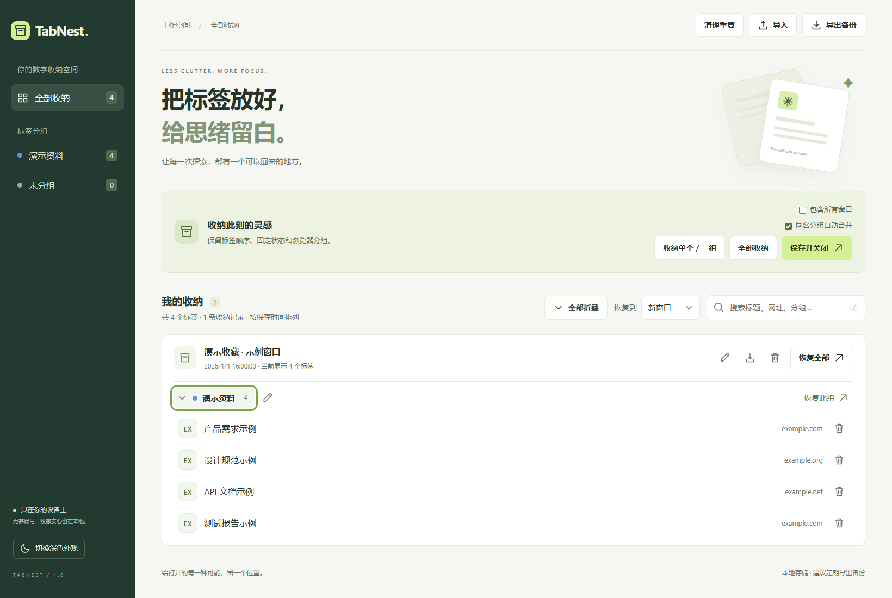
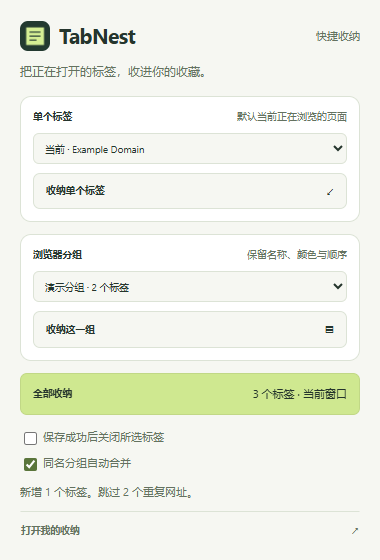

<!-- TabNest 使用说明：安装、分组语义、数据边界和可运行验证。 -->
# TabNest · 标签收纳

[English](README_EN.md) · 简体中文

一个无需账号、无需构建、完全本地运行的 Edge Manifest V3 扩展。



## 功能亮点

- 一键收纳单个标签、浏览器分组、当前窗口或全部窗口。
- 保留标签顺序、固定状态以及 Edge 分组的名称、颜色和折叠状态。
- 在当前窗口或新窗口恢复单条、整组或整条收纳记录。
- 按完整网址自动去重，支持单条删除、撤销、搜索和全部折叠。
- 导入、导出 JSON，兼容 OneTab 文本格式。
- 数据仅保存在本机，不使用账号、统计、远程脚本或远程图标服务。



## 安装（约一分钟）

1. 将 `TabNest-Edge.zip` 解压到一个长期保留的目录；也可直接使用现有 `TabNest` 文件夹。
2. 在 Edge 地址栏输入 `edge://extensions`，打开「开发人员模式」。
3. 点击「加载解压缩的扩展」，选择包含 `manifest.json` 的 **TabNest 文件夹**。
4. 在 Edge 的扩展菜单中固定 TabNest。在正在浏览的网页上点击图标，直接打开快捷收纳菜单。

这是本地开发者安装包，不是商店签名安装包。无需 npm install。不要移动或删除安装目录；更新代码后在扩展管理页点击「重新加载」。

**OneTab 重导归组**：重新导入 TXT 时，无需先删除收藏。已有未分组、未固定的相同网址会移回对应导入分组；已有命名分组和固定标签保持原状，重复链接不再新增。

## 使用

- **收纳单个标签**：在网页上点击工具栏图标，默认选中该网页，点击「收纳单个标签」。也可在列表中换成此窗口的另一个标签。
- **收纳这一组**：默认选中当前网页所属的 Edge 分组；也可从列表选择其他原生分组，只保存选中组中的标签。
- **全部收纳**：保存当前窗口的所有常规标签。快捷菜单默认仅保存；勾选「保存成功后关闭所选标签」可在保存后关闭。
- **管理页入口**：快捷菜单底部点击「打开我的收纳」。管理页也可点击「收纳单个 / 一组」选择已打开的标签或分组。
- **保存并关闭**：先写入本地存档，成功后关闭对应原标签；已导航到其他网址的标签会保留。
- **包含所有窗口**：一次收纳全部普通窗口，每个窗口先形成一条记录；默认只处理当前窗口。
- **恢复全部 / 恢复此组**：在「我的收纳」右侧的「恢复到」选择当前窗口或新窗口，再点击恢复按钮。选择会记住。恢复到当前窗口时保留原有标签，新窗口模式创建独立窗口；两者均保留收藏供重复使用。单击标签标题也遵循所选位置；Ctrl/中键等浏览器快捷打开行为保持原生行为。
- **单条删除**：每个收藏行右侧的垃圾桶图标只删除该条收藏，不关闭浏览器中正在打开的页面。底部提示提供 15 秒撤销入口（仅最近一次单条删除）；删空的分组或记录自动清理，撤销会恢复标签、分组和固定状态，并保留期间新增的其他收藏。若相同网址已重新收藏，撤销不会重复添加。
- **分组**：保留 Edge 原生分组名称、颜色、折叠状态；保留标签顺序和固定状态。
- **管理**：支持搜索标题/网址/分组、重命名收纳或分组、折叠列表、删除确认、浅色/深色外观。按 `/` 聚焦搜索。
- **全部折叠**：在收纳列表上方一键折叠当前显示的全部分组，按钮随后切换为「全部展开」。
- **左侧分组导航**：「全部收纳」下方列出已保存的分组，并单独显示「未分组」。数字是标签数量。同名分组汇总为一个入口，未命名的原生分组和未分组标签分开显示。切换分组后，搜索只在该分组内生效；点击全部收纳可清空筛选。保存、删除或重命名后列表自动更新，当前分组消失则回到全部收纳。窄窗口中分组导航改为可横向滚动的列表。

## 自动去重

保存单个标签、整组、整个窗口以及导入文件，统一按完整网址去重。相同网址已存在时跳过新副本；TXT 重导可补回未分组标签的分组，已有分组不被覆盖。重复点击不会产生新记录，多个窗口同时操作也不会重复写入。关闭同名分组合并不会关闭网址去重。

浏览器标准化后相同的网址视为重复，例如 `https://example.com` 与 `https://example.com/`。查询参数和锚点不同仍视为不同链接，不擅自删除参数。

旧版本已经产生的重复记录，可点击管理页右上角「清理重复」。相同网址仅保留列表中第一份（最新记录优先），移空的分组和记录一并清理，不关闭任何浏览器标签。其他副本的分组归属会随副本移除。

## 同名分组自动合并

默认启用，也可关闭；开关会记住。保存、导入和分组重命名时生效。

- 按分组名称匹配，忽略名称首尾空白，区分大小写；空名称和未分组标签不合并。
- 同名分组合并到列表中最新的收纳记录，采用目标组的颜色和折叠状态。
- 新记录中的组内标签在前，旧记录中的组内标签追加在后；新增标签在合并前先按网址去重。
- 旧记录中的其他分组、未分组标签、固定标签继续保留。移空的记录会消失。
- 合并会让来自不同窗口的同名组聚集在同一记录中；需要保留完全独立的窗口快照时，关闭该开关。
- 导入对话框可单独选择是否合并；开关关闭时，JSON 中未重复的标签保留各自记录及分组。

## 导入导出

右上角导出全部记录，卡片上的下载按钮仅导出该条记录。

**JSON（推荐）**导出完整分组、颜色、折叠、标签顺序、固定状态与保存时间。导入只追加尚未收纳的网址，已有数据不会被覆盖；启用合并时按上述规则重新归组。重复导入不会再增加相同链接。

**OneTab 文本**支持以下格式，以空行分隔记录/组；可选择文件或直接粘贴：

```text
https://example.com | 页面标题
https://example.org | 另一个页面

https://example.net | 下一组
```

文本格式保留空行分组边界。导入时每段建立一个实际分组，自动命名「导入分组 1、2…」并分配颜色，左侧导航可直接筛选；可随后重命名。文件本身不包含原组名、原颜色或固定状态，这些原始元数据无法还原。文本导出仍按组分隔链接。

单次导入限制为 15 MB、2,000 条收纳记录、50,000 个标签。TXT 中的 edge/chrome/about 等浏览器内部页会跳过并报告数量，不影响其余网页和分组；全部为内部页时会提示无可导入网页。其他损坏结构、危险网址或不合法 JSON 仍使整次导入失败，现有数据保持原状。

## 数据与恢复范围

- 存储在 `chrome.storage.local`，不上传、不统计、不使用远程脚本或远程图标服务。
- **卸载扩展或清除扩展数据会删除收藏**，请定期导出 JSON。重新加载扩展不会删除存档。
- 保存 HTTP、HTTPS、file 和 FTP 链接；浏览器内部页、扩展页、临时 blob/data 页面及隐私窗口不保存。
- file 链接是否能打开取决于 Edge 的文件访问设置；FTP 是否可访问取决于浏览器或系统支持。
- 保存的是标题、网址和分组元数据，不能恢复页面表单、滚动位置、登录状态或前进后退历史。
- 恢复过程中如果某标签打不开，已打开的标签保留，存档完整保留，并显示错误，可根据提示重试。
- 自动合并开启时，组内顺序保持，跨组的原始窗口布局可能改变。

## 验证

已在隔离配置的真实 Edge 中加载扩展，验证保存、保留原生组和固定标签、恢复、同名合并、JSON 往返、OneTab 文本、搜索、重命名、下载、保存后关闭、删除、刷新持久化，以及深色和窄屏布局。额外通过多窗口保存、单组折叠状态恢复、并发导入不丢记录、写入失败不关闭原标签，以及重命名自动合并的检查。

文档截图使用隔离测试配置内的示例收藏；正式加载后的扩展没有预置收藏。

数据模型回归测试使用 Node 内建测试器，无需安装依赖：

```powershell
node --test tests/model.test.mjs
```

实现参考：[Tabs API](https://developer.chrome.com/docs/extensions/reference/api/tabs)、[TabGroups API](https://developer.chrome.com/docs/extensions/reference/api/tabGroups)。

## 开源协议

TabNest 使用 [MIT License](LICENSE) 开源。
